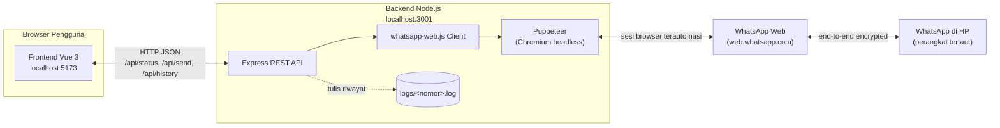
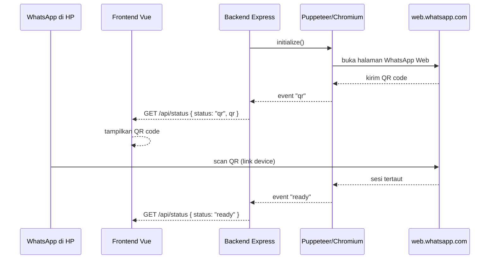

# WA Send

**Versi:** 1.0.0
**Dibuat oleh:** [seeomkus](https://seeomkus.com)

Aplikasi sederhana untuk mengirim pesan WhatsApp: backend TypeScript (Express + whatsapp-web.js) dan frontend Vue 3. Berjalan di Windows maupun Linux.

## Arsitektur & Topologi



Backend tidak memakai WhatsApp Business API resmi — `whatsapp-web.js` mengontrol instance Chromium (via Puppeteer) yang membuka `web.whatsapp.com` seperti browser biasa, persis seperti saat Anda scan QR di WhatsApp Web manual.

### Alur login (scan QR)



### Alur kirim pesan

```mermaid
sequenceDiagram
    participant FE as Frontend Vue
    participant BE as Backend Express
    participant WWJS as whatsapp-web.js
    participant WA as WhatsApp Web
    participant LOG as logs/&lt;nomor&gt;.log

    FE->>BE: POST /api/send { phone, message }
    BE->>WWJS: getNumberId(phone)
    WWJS->>WA: validasi nomor terdaftar
    WA-->>WWJS: numberId
    BE->>WWJS: sendMessage(numberId, message)
    WWJS->>WA: kirim pesan
    WA-->>WWJS: terkirim
    BE->>LOG: append [timestamp] message
    BE-->>FE: { success: true }
```

## Prasyarat
- [Node.js](https://nodejs.org) versi 18 ke atas (termasuk npm)
- Git
- Koneksi internet (untuk WhatsApp Web dan mengunduh Chromium saat instalasi)

## 1. Clone repository

```
git clone https://github.com/seeomkus/wa-send.git
cd wa-send
```

## 2. Instalasi dependency (sekali di awal)

```
npm run install:all
```
Perintah ini menjalankan `npm install` di folder `backend` dan `frontend` sekaligus. Proses ini juga akan mengunduh Chromium (dependency Puppeteer), jadi bisa memakan waktu beberapa menit tergantung koneksi internet.

## 3. Menjalankan aplikasi

| Perintah | Fungsi |
|---|---|
| `npm run start` | Menjalankan backend + frontend (mode dev) di background |
| `npm run status` | Cek apakah backend/frontend sedang berjalan dan merespons |
| `npm run stop` | Menghentikan backend + frontend |
| `npm run restart` | Stop lalu start ulang |
| `npm run build` | Build production untuk backend (`backend/dist`) dan frontend (`frontend/dist`) |

Setelah `npm run start`:
- Backend: `http://localhost:3001`
- Frontend: `http://localhost:5173`

Log masing-masing service tersimpan di `logs/backend.log` dan `logs/frontend.log` (berguna untuk lihat QR code baru atau error, karena proses jalan di background).

Saat pertama kali dijalankan, buka `http://localhost:5173`, scan QR code yang muncul dengan WhatsApp di HP Anda, lalu mulai kirim pesan.

## 4. Alur kerja tanpa script (manual)

Jika lebih suka menjalankan tiap service di terminalnya sendiri (log langsung terlihat):

```
cd backend && npm run dev
```
```
cd frontend && npm run dev
```

## 5. Catatan
- Sesi login WhatsApp disimpan secara lokal (folder `backend/.wwebjs_auth`) sehingga tidak perlu scan ulang setiap kali backend dijalankan. Untuk logout, hapus folder ini atau unlink perangkat dari HP (WhatsApp → Perangkat Tertaut).
- Backend membutuhkan Chromium (otomatis diunduh oleh Puppeteer, dependency dari whatsapp-web.js).
- Nomor tujuan ditulis dengan format kode negara tanpa tanda `+`, contoh: `6281234567890`.
- Riwayat chat per nomor tersimpan otomatis di `backend/logs/<nomor>.log`.
- Menutup tab browser frontend tidak menghentikan backend/koneksi WhatsApp — gunakan `npm run stop` untuk benar-benar menghentikannya.
